# StudySphynx

  

<h1 align="center">Study Sphynx</h1>

 

We have built Sphynx Study, a one stop website for all educational purposes.
Users can create self-learning courses and share them with other users. We provide courses on a variety of topics to hone your skills and improve your knowledge.  

Users have to register using their email id and password before availing the functionalities of our website.They can then login using the registered credentials.
Users can view all these courses via their accounts as well as make and save notes for any course.

Ratings and reviews -Users can rate and review any course. They can view other ratings and reviews to determine the best course for them.

Learning paths - Users can create a stepwise course, with each step having separate learning resources, assessment and solution links to help share your skills. 

We have a feature to write notes and save them.A digital notebook is present just adjacent to the course video to help you take notes simultaneously while watching the video. We can save these notes and access them later by going to the page My Notes.

You can view anyone’s profile and see their social profiles,bio , learning paths and their goals.

Calendar and Timetable - You can create an event calendar of virtual events related to your interests.You can create a timetable of your study schedule and upcoming activities within the calendar.

Friend requests - You can make connections by sending friend requests and the other person accepting it.

About us page gives a brief overview of our site and what we stand for.

You can also contact us through the contact us page.
We primarily used Discord as our means of communication as well as to plan the website. We used git as our VCS, and github to share and collaborate on the project. We build the backend in Node using Express, using MongoDB with Mongoose.

 

## PARTICPANTS

* Nilesh Aditya
* Pragya Gupta
* Raghav Gupta
* Pranav Bhatnagar
* Prashubh Atri
---
## HOME
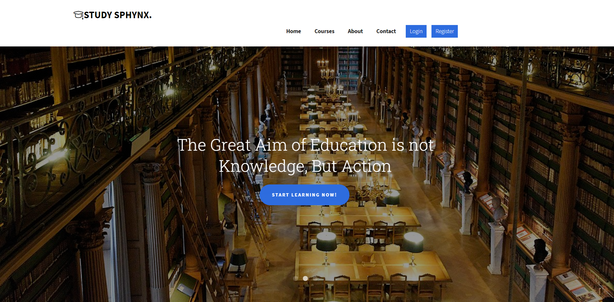
&nbsp;

## About US
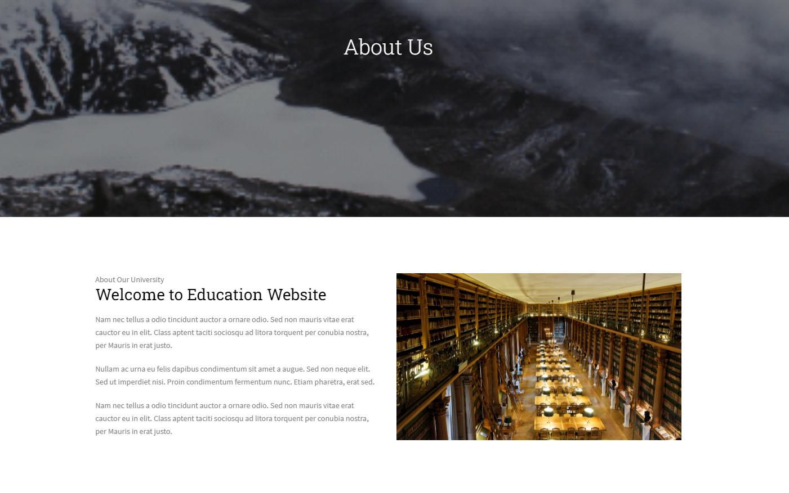
&nbsp;

## Contact Us
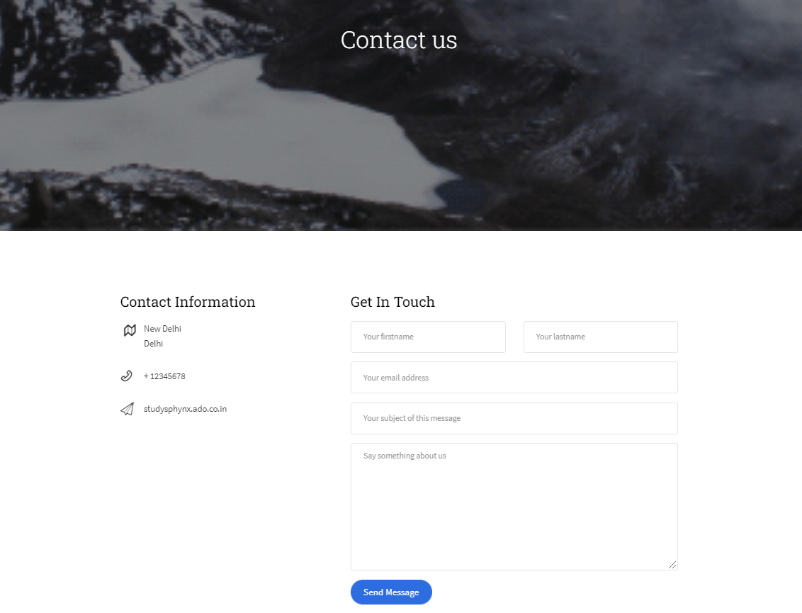
&nbsp;

## Sign In
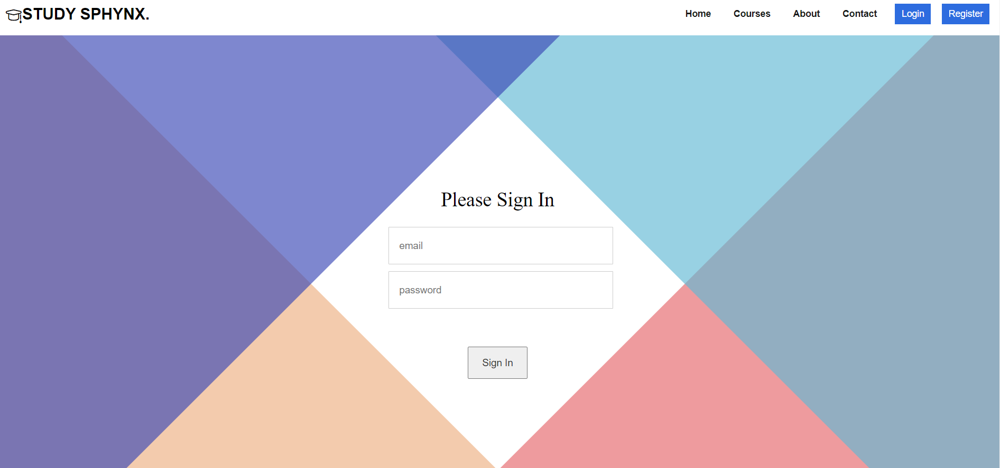
&nbsp;

## Dashboard
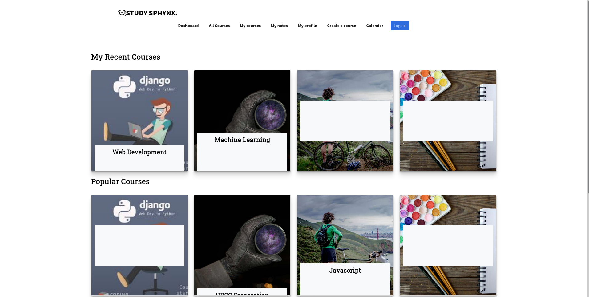
&nbsp;

## All Courses
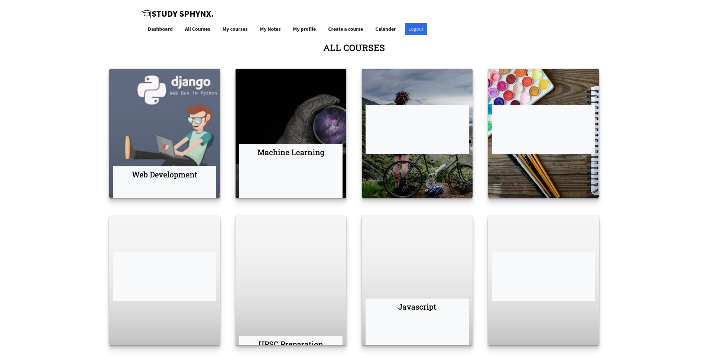
&nbsp;

## Profile
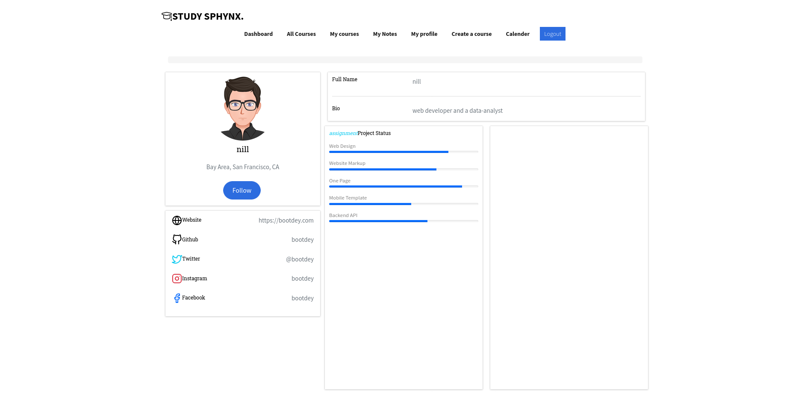
&nbsp;

## Create A Course
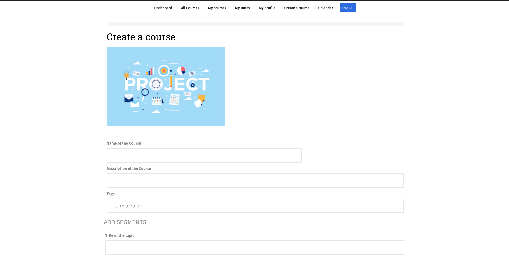
&nbsp;

## Calendar
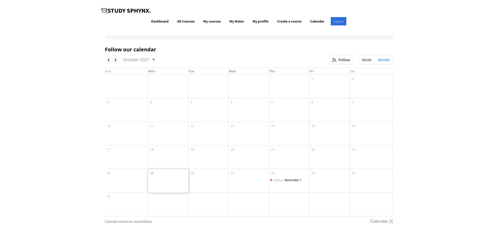
&nbsp;

## Course Pages (Course Details)
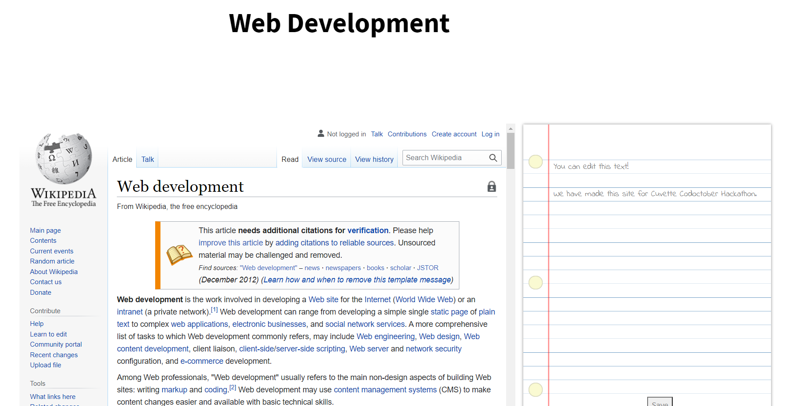
&nbsp;

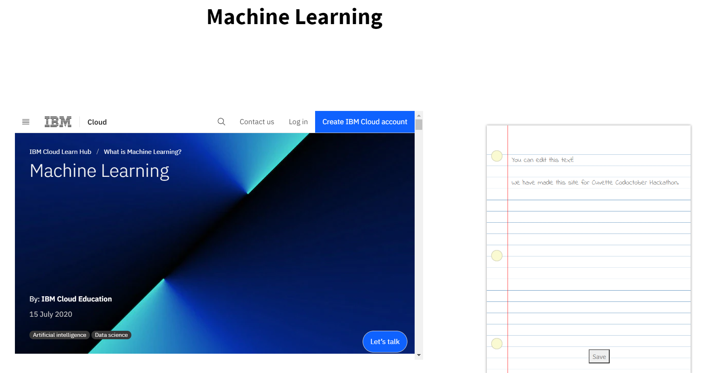
&nbsp;
---